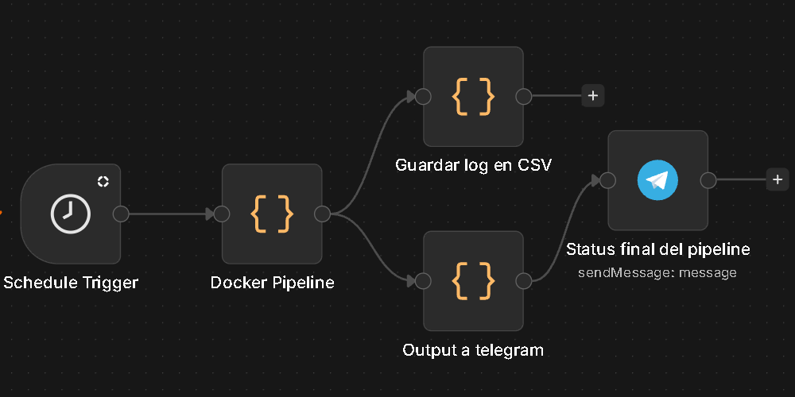

# Supermarket-pipeline-n8n-docker
Este proyecto es un pipeline ETL automatizado que extrae precios de supermercados, los valida y los carga en una base de datos MySQL. Todo el flujo está orquestado con **n8n**, ejecutado con **Docker** y programado automáticamente.

---

## 🚀 Características

- Ejecución automática con n8n (cron programado)
- Ejecución del pipeline en Docker
- Extracción de datos desde múltiples supermercados
- Validación de datos (duplicados, precios inválidos, etc.)
- Carga en MySQL (modelo raw + fact)
- Sistema de logs en CSV + Telegram
- Control de ejecuciones con `ingestion_key`
- Pipeline completamente automatizado

---

## 🏗️ Arquitectura

---

## ⚙️ Cómo funciona

1. n8n ejecuta el workflow (manual o programado)
2. Docker corre el pipeline en Python
3. Se extraen datos de supermercados
4. Se validan y limpian los datos
5. Se cargan en MySQL:
   - `raw_prices`
   - `fact_prices`
6. Se generan logs:
   - Archivo CSV
   - Mensaje por Telegram
7. Cada ejecución queda identificada con `ingestion_key`
docker compose run --rm app python main.py --manual

